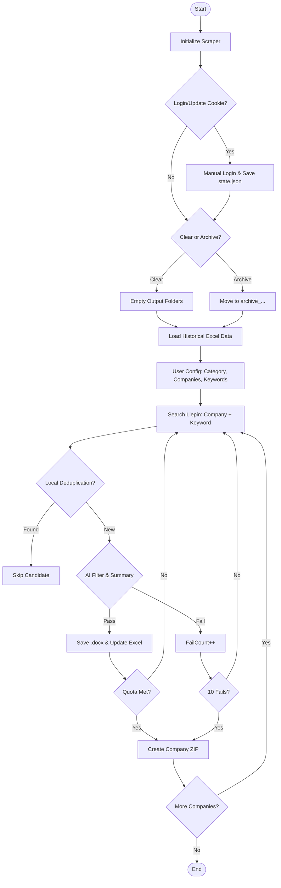

# Liepin Resume Scraper Advanced / 猎聘简历自动化高级助手

[English](#english) | [中文](#chinese)

---

<a name="english"></a>
## 🇬🇧 English Description

### Introduction
**Liepin Resume Scraper Advanced** is a professional automation tool designed to streamline recruitment on Liepin.com. It combines **Playwright** browser automation with **Volcengine AI (Doubao)** for intelligent candidate screening and profile summarization.

### Key Features
- **🤖 AI Screening**: Uses Doubao API to verify candidate-job fit (YES/NO) and generate concise profile summaries.
- **📄 Clean Conversion**: Saves web resumes as formatted `.docx` files, stripping ads and broken elements.
- **📂 Smart Management**: 
    - **Archiving**: Automatically archives old data to `archive_YYYYMMDD_HHMMSS` folders if you choose not to clear directories.
    - **Deduplication**: Automatically loads historical Excel data to avoid re-processing or paying for the same candidate twice.
- **📦 Bundling**: Groups resumes into ZIP files named `Liepin-[Company]-[Count]-[ID].zip`.
- **📊 Dynamic Reporting**: 
    - Generates optimized Excel reports (Name moved forward for better readability).
    - **Auto-Naming**: Excel files are automatically named `Category-Company-Keyword.xlsx` and dynamically updated based on search progress.
- **⚡️ Efficiency**: 
    - **Early Stopping**: Skips irrelevant keywords after 10 consecutive failures.
    - **Keyword Search**: Supports multiple keywords separated by `-`.
    - **Headless Mode**: Runs in the background by default for a seamless experience.
- **💻 Pro CLI**: Colorful terminal UI with progress bars, input "back" functionality, and real-time stats.

### Installation

#### From Source (All Platforms: Windows, Mac, Linux)
Ensure you have **Python 3.8+** installed.

1.  **Clone & Enter:**
    ```bash
    git clone https://github.com/DAMEHENRY/liepin-resume-scraper-advanced.git
    cd liepin-resume-scraper-advanced
    ```
2.  **Install Dependencies:**
    ```bash
    pip install -r requirements.txt
    ```
3.  **Browser Setup:**
    ```bash
    playwright install chromium
    ```
4.  **Environment Configuration:**
    Create a `.env` file in the root directory:
    ```env
    VOLC_SECRETKEY=your_actual_api_key_here
    ```

### Usage
1.  **Run**: `python main.py`
2.  **Login**: On first run, a browser opens for manual login. Session is saved to `state.json`.
3.  **Configure**: Follow CLI prompts to set Category, Companies (e.g., `Google 10/MS 5`), and Keywords (e.g., `Product-Data`).
4.  **Monitor**: View real-time progress in the terminal.

---

<a name="chinese"></a>
## 🇨🇳 中文介绍

### 简介
**猎聘简历自动化高级助手** 是一款专为高效招聘设计的自动化工具。它深度整合了 **Playwright** 自动化技术与 **火山引擎 (豆包)** 大模型，实现了从简历搜索、AI 智能初筛到文档归档的全流程闭环。

### 核心功能
- **🤖 AI 智能初筛**: 调用豆包 API 自动判断候选人匹配度 (YES/NO)，并生成“在职时间+公司+岗位”格式的画像总结。
- **📄 格式清洗**: 将网页简历转换为排版整洁的 `.docx` 文档，去除冗余广告。
- **📂 智能文件管理**:
    - **自动归档**: 启动时可选择保留旧数据，程序将自动移动至 `archive_时间戳` 文件夹。
    - **精准去重**: 启动时自动扫描历史 Excel 数据，发现“姓名+职位+在职时间”完全匹配时自动跳过，节省资源。
- **📦 自动打包**: 按公司配额自动生成 `猎聘-[公司]-[数量]-[标识].zip` 压缩包。
- **📊 自动化报表**:
    - **表格优化**: 优化列顺序（姓名调前），更符合阅读习惯。
    - **动态命名**: Excel 文件根据搜集目标自动命名（分类-公司-关键词），并随搜索进度实时修正文件名。
- **⚡️ 高效策略**:
    - **早停机制**: 连续 10 份简历不匹配则自动跳过当前关键词。
    - **关键词搜索**: 支持使用 `-` 分隔多个关键词同时搜索。
    - **静默运行**: 默认开启无头模式，不干扰日常工作。
- **💻 极客终端**: 基于 Rich 库开发，支持输入回退 (`b`)、彩色进度条和实时成功率统计。

### 安装步骤

#### 源码安装 (通用: Windows, Mac, Linux)
需提前安装 **Python 3.8+**。

1.  **克隆项目:**
    ```bash
    git clone https://github.com/DAMEHENRY/liepin-resume-scraper-advanced.git
    cd liepin-resume-scraper-advanced
    ```
2.  **安装依赖库:**
    ```bash
    pip install -r requirements.txt
    ```
3.  **初始化浏览器环境:**
    ```bash
    playwright install chromium
    ```
4.  **配置环境变量:**
    在根目录创建 `.env` 文件并填入：
    ```env
    VOLC_SECRETKEY=您的火山引擎 API密钥
    ```

### 使用说明
1.  **启动**: `python main.py`
2.  **登录**: 首次运行需在弹出的浏览器中手动扫码登录，状态将存入 `state.json` 以供后续免登录使用。
3.  **交互配置**: 按提示输入分类、公司及目标份数（如：`腾讯 10/阿里 5`）、搜索关键词（如：`产品经理-数据分析`）。
4.  **获取结果**: 任务完成后，在 `data/` (Excel), `resumes/` (Word), `zips/` (压缩包) 查看结果。

---

### Logic Flowchart / 逻辑流程图


---

### Disclaimer / 免责声明
This tool is for educational and personal efficiency purposes only. Please comply with Liepin.com's Terms of Service and Robots.txt. The author is not responsible for any account restrictions or legal issues.

本工具仅供学习和个人提效使用。使用时请遵守猎聘网服务条款。因使用本工具导致的账号风险或法律责任由使用者自行承担。