# Liepin Resume Scraper Advanced / 猎聘简历自动化高级助手

[English](#english) | [中文](#chinese)

---

<a name="english"></a>
## 🇬🇧 English Description

### Introduction
**Liepin Resume Scraper Advanced** is a powerful automation tool designed to streamline the recruitment process on Liepin.com. It leverages **Playwright** for browser automation and **Volcengine AI (Doubao)** for intelligent candidate screening.

This tool automatically searches for candidates, analyzes their resumes against your specific job requirements using AI, saves qualified resumes as clean Word documents (.docx), and generates detailed Excel reports.

### Key Features
- **🤖 AI-Powered Screening**: Uses Volcengine (Doubao) API to verify if a candidate matches your job description (YES/NO) and generates a concise profile summary.
- **📄 Format Conversion**: Automatically saves web resumes as formatted `.docx` files (removing ads and broken images).
- **📦 Smart Archiving**: Bundles resumes into ZIP files by company and quota.
- **📊 Excel Reporting**: Generates a comprehensive `.xlsx` report with candidate details, AI summaries, and contact status.
- **⚡️ Efficiency**: 
    - **Deduplication**: Checks local history to avoid re-processing or paying for the same candidate twice.
    - **Early Stopping**: Automatically skips irrelevant positions after consecutive failures.
    - **Resume Mode**: Supports resuming session cookies to avoid frequent logins.
- **💻 CLI Interface**: Beautiful terminal UI with progress bars, color-coded logs, and interactive configuration.

### Prerequisites
- Python 3.8+
- A [Volcengine](https://www.volcengine.com/) Account (for AI analysis) with an API Key.
- Chrome/Chromium browser (installed automatically via Playwright).

### Installation

1. **Clone the repository:**
   ```bash
   git clone https://github.com/DAMEHENRY/liepin-resume-scraper-advanced.git
   cd liepin-resume-scraper-advanced
   ```

2. **Install dependencies:**
   ```bash
   pip install -r requirements.txt
   playwright install chromium
   ```

3. **Configure Environment Variables:**
   Create a `.env` file in the root directory and add your Volcengine API Key:
   ```env
   VOLC_SECRETKEY=your_actual_api_key_here
   ```

### Usage

1. **Run the script:**
   ```bash
   python main.py
   ```

2. **Login:**
   - On the first run, a browser window will open.
   - Log in to Liepin.com manually.
   - Return to the terminal and press Enter. The session will be saved to `state.json`.

3. **Follow the CLI prompts** to set:
   - Target Companies (e.g., `Google 10/Microsoft 5`)
   - Target Positions
   - Resume Filters (Age, Last Login, etc.)

### Output Structure
- `data/`: Contains the Excel reports (`.xlsx`).
- `resumes/`: Individual candidate resumes (`.docx`).
- `zips/`: Compressed packages of resumes grouped by company.

---

<a name="chinese"></a>
## 🇨🇳 中文介绍

### 简介
**猎聘简历自动化高级助手** 是一款专为猎聘网（Liepin.com）设计的高效招聘辅助工具。它结合了 **Playwright** 浏览器自动化技术和 **火山引擎 (豆包)** 的大模型能力，实现了从搜索到筛选的全流程自动化。

该工具可以根据您设定的公司和职位自动搜索候选人，利用 AI 智能判断简历是否符合要求，自动下载简历为 Word 文档，并生成详细的 Excel 汇总报表。

### 核心功能
- **🤖 AI 智能初筛**: 调用火山引擎 API，根据您的“访谈提纲”自动判断候选人是否匹配 (YES/NO)，并生成一句话画像总结。
- **📄 格式清洗与转换**: 将网页版简历自动保存为排版整洁的 `.docx` 文档，自动移除广告和无效图片。
- **📦 智能打包**: 按目标公司将下载的简历自动打包为 ZIP 文件，方便归档。
- **📊 数据报表**: 自动生成包含候选人姓名、职位、AI 评价、原文链接等信息的 Excel 表格。
- **⚡️ 高效策略**: 
    - **自动去重**: 启动时加载历史数据，避免重复抓取或浪费 AI token。
    - **早停机制**: 连续 N 次不匹配自动跳过当前搜索条件，节省时间。
    - **断点续传**: 支持保存登录状态 (Cookie)，无需每次运行都扫码登录。
- **💻 交互式终端**: 基于 Rich 库开发的精美 CLI 界面，支持进度条、彩色日志和交互式配置。

### 环境要求
- Python 3.8 或更高版本
- [火山引擎](https://www.volcengine.com/) 账号 (用于 AI 分析)，需获取 API Key。
- Chrome/Chromium 浏览器 (脚本会自动安装)。

### 安装步骤

1. **克隆仓库:**
   ```bash
   git clone https://github.com/DAMEHENRY/liepin-resume-scraper-advanced.git
   cd liepin-resume-scraper-advanced
   ```

2. **安装依赖:**
   ```bash
   pip install -r requirements.txt
   playwright install chromium
   ```

3. **配置环境变量:**
   在项目根目录下创建一个 `.env` 文件，并填入您的火山引擎密钥：
   ```env
   VOLC_SECRETKEY=您的火山引擎API密钥
   ```

### 使用方法

1. **运行程序:**
   ```bash
   python main.py
   ```

2. **登录账号:**
   - 首次运行时，程序会弹出一个浏览器窗口。
   - 请在窗口中手动扫码登录猎聘网。
   - 登录成功后回到终端按回车，登录状态将保存至 `state.json`。

3. **按提示输入配置:**
   - 输入目标公司及配额 (如: `腾讯 10/阿里 5`)
   - 输入目标职位 (如: `产品经理/数据分析师`)
   - 设置筛选条件 (离职时间、最后登录时间等)

### 输出文件说明
- `data/`: 存放生成的 Excel 汇总表格。
- `resumes/`: 存放下载的个人简历 Word 文档。
- `zips/`: 存放按公司打包好的简历压缩包。

### 逻辑流程图 / Logic Flowchart

```mermaid
flowchart TD
    %% Initialization Phase
    Start([Start]) --> Init[Initialize LiepinScraper]
    Init --> StartListener[Start Keyboard Listener]
    StartListener --> BrowserCheck[Ensure Browsers Installed]
    
    %% User Configuration Phase
    BrowserCheck --> LoginQuery{Update Cookie/Login?}
    LoginQuery -- Yes --> Login[save_session: Manual Login & Save state.json]
    LoginQuery -- No --> ClearQuery{Clear Output Dirs?}
    Login --> ClearQuery
    
    ClearQuery -- Yes --> Clear[clear_output_directories]
    ClearQuery -- No --> Archive[archive_output_directories]
    
    Clear --> LoadHistory[load_historical_data: Load local Excel files]
    Archive --> LoadHistory
    
    LoadHistory --> GetInputs[get_user_inputs: Category, Companies, Positions]
    
    %% Main Scraper Logic
    GetInputs --> RunScraper[run_scraper]
    RunScraper --> CompanyLoop{For each Target Company}
    
    CompanyLoop -- Next Company --> PositionLoop{For each Position}
    CompanyLoop -- All Done --> SaveExcel[save_data_to_excel]
    
    PositionLoop -- Next Position --> Search[Search Liepin: Company + Position]
    PositionLoop -- All Done --> ZipFiles[zip_company_files]
    ZipFiles --> CompanyLoop
    
    Search --> PageLoop{For each Page}
    PageLoop -- Next Page --> CandidateLoop{For each Candidate Link}
    PageLoop -- No More Pages --> PositionLoop
    
    CandidateLoop -- Next Candidate --> PauseCheck{Paused?}
    CandidateLoop -- No More Candidates --> PageLoop
    
    PauseCheck -- Yes --> Wait[Wait...] 
    Wait --> PauseCheck
    PauseCheck -- No --> OpenResume[Open Resume Page]
    
    %% Validation Chain
    OpenResume --> CheckLoginDate{Login Date OK?}
    CheckLoginDate -- No --> CountFail[FailCount++]
    CheckLoginDate -- Yes --> CheckWorkTime{Departure Date OK?}
    
    CheckWorkTime -- No --> CountFail
    CheckWorkTime -- Yes --> ExtractInfo[Extract Name, Title, Gender]
    
    ExtractInfo --> CheckDuplicate{Is Duplicate?}
    CheckDuplicate -- Yes --> CountFail
    CheckDuplicate -- No --> AICheck{AI Match Briefing?}
    
    AICheck -- No --> CountFail
    AICheck -- Yes --> CheckCompanyMatch{Current Company Match?}
    
    CheckCompanyMatch -- No --> CountFail
    CheckCompanyMatch -- Yes --> ProcessSuccess[Process Qualified Candidate]
    
    CountFail --> NextCandidate[Continue to Next Candidate]
    NextCandidate --> CandidateLoop
    
    %% Success Path
    ProcessSuccess --> AISummary[AI Summarize Profile]
    AISummary --> SaveData[Add to Memory saved_contacts]
    SaveData --> SaveDocx[save_resume_as_docx]
    SaveDocx --> CheckQuota{Company Quota Met?}
    
    CheckQuota -- Yes --> StopPosition[Break Position Loop]
    StopPosition --> ZipFiles
    CheckQuota -- No --> ResetFail[Reset FailCount]
    ResetFail --> NextCandidate
    
    %% Finalization
    SaveExcel --> RestartQuery{Start New Round?}
    RestartQuery -- Yes --> LoginQuery
    RestartQuery -- No --> End([End])
    
    %% Styling
    style Start fill:#e1bee7,stroke:#8e24aa,stroke-width:2px
    style End fill:#e1bee7,stroke:#8e24aa,stroke-width:2px
    style ProcessSuccess fill:#bbdefb,stroke:#1976d2,stroke-width:2px
    style SaveData fill:#c8e6c9,stroke:#388e3c,stroke-width:2px
    style CountFail fill:#ffccbc,stroke:#d84315,stroke-width:2px
```


---

### Disclaimer / 免责声明
This tool is for educational and personal efficiency purposes only. Please comply with Liepin.com's Terms of Service and Robots.txt. The author is not responsible for any account restrictions or legal issues arising from the use of this tool.

本工具仅供学习和个人提效使用。使用时请遵守猎聘网的服务条款及 Robots 协议。因使用本工具导致的账号限制或法律风险，作者不承担任何责任。
